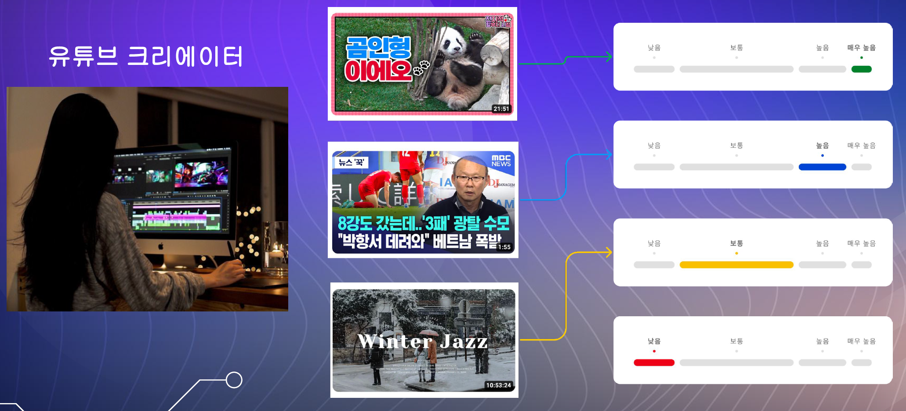
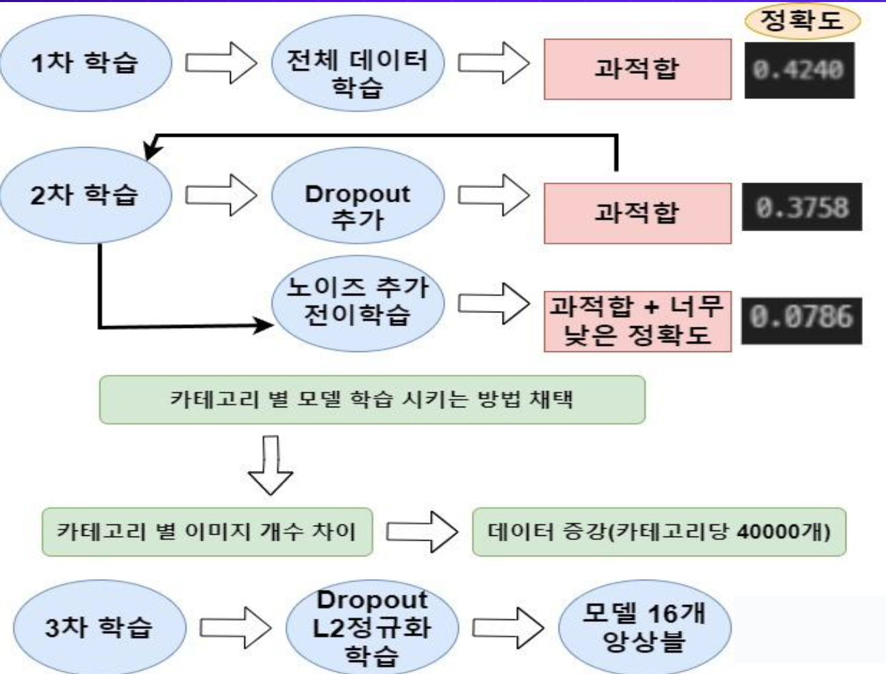
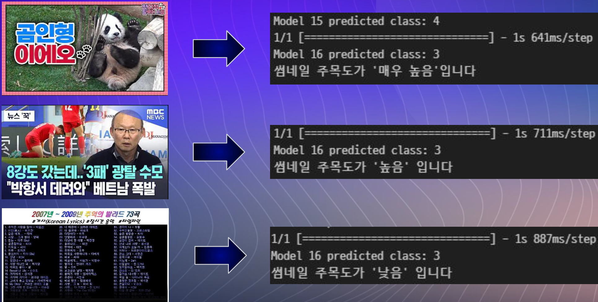

# 3차 프로젝트

## 어그로(주목도) 높은 유튜브 썸네일 이미지 분류 AI 어썸 판별기

## 기획의도
- 시간이 지날수록 이용자수가 점점 많아지는 유튜브에서 사람들은 기회가 된다면 한 번쯤 해보고 싶어 한다.
- 하지만 수 많은 영상들 중에 나의 영상을 남들이 보게 하려면 어느정도 주목도가 높은 유튜브 썸네일을 사용해야만 한다.
- Ai를 이용해서 주목도가 어느 정도 나오는지 판단을 해줌으로써 제대로 된 썸네일을 사용할 수 있게 도와준다.

## 목표

## 데이터 수집
- 유튜버 랭킹 사이트 내 카테고리별 랭킹을 참고해 총 1000개의 채널을 수집
- 유명 유튜버뿐만 아니라 일반 유튜버 썸네일도 수집하기 위해 키워드를 검색해서 데이터 수집

## 데이터 전처리
- 너무 많은 카테고리와 중복되는내용들이 많아서 16개의 카테고리로 줄인 후 분류
- 썸네일 라벨을 조회수와 구독자수 등을 고려해서 매우높음, 높음, 보통, 낮음으로 라벨 생성
- 썸네일들을 모델에 맞게 사이즈를 224 x 224로 수정

## 모델 선정
- Xecption, Resnet50, InceptionV3 3개의 모델중 정확도가 제일 높은 Resnet50으로 모델 선정

## 학습 과정

1개의 이미지를 16개 모델의 예측확률을 평균해서 제일 높은 확률을 결정

## 모델 결과
